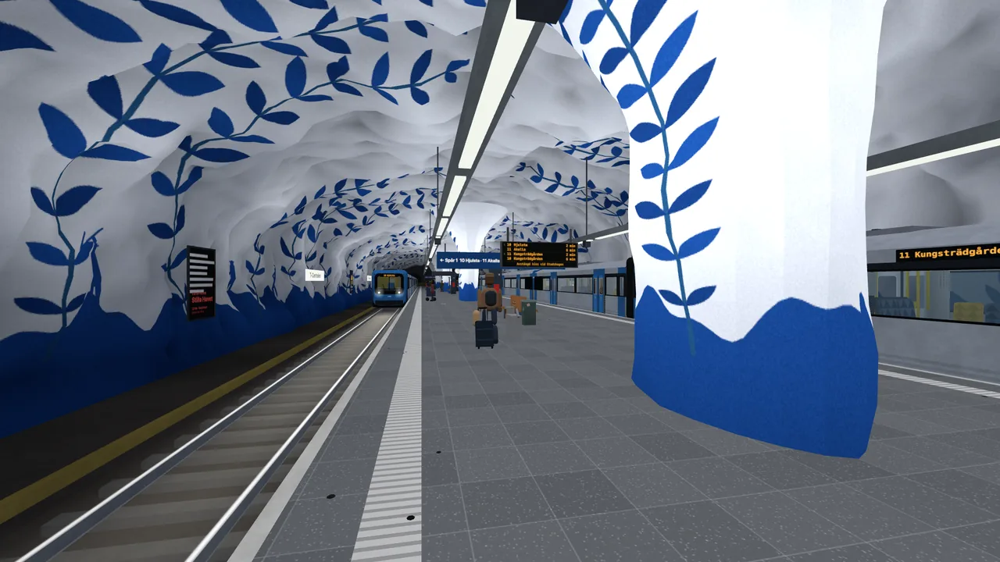

# Under Stockholm

**Stockholm's whole metro in your browser: walk the platforms, ride the trains, all 100 stations.**

<p align="center">
  
</p>

Every visitor shares the same timetable, and the trains can follow SL's live metro. Change lines at T-Centralen, feel Stockholm's real weather at the exits, find Kymlinge, or drive a C20 yourself. TypeScript, three.js and Rapier, no game engine.

## Play

Play it at [understockholm.com](https://understockholm.com/), or run it yourself:

```bash
bun install
bun run dev
```

Open http://localhost:5180 and click **Gå ner i tunnelbanan** (or **English** at the top for English menus). How it is hosted is in [DRIFT.md](docs/DRIFT.md). The same page has three more ways in:

- **Se en tur** jumps through rush hour, snow, Lucia, 1975, Silverpilen and Kymlinge until you take over.
- **Se hela nätet** shows every line at its real depth under Stockholm, with every train as a point of light.
- **Ett liv på blå linjen** is one ride from Kungsträdgården to Akalla where every station is a stretch of years, 1975 to 2050.

Phones work without a keyboard: thumbstick to walk, drag to look. Gamepads work too. Keys are in [GAMEPLAY.md](docs/GAMEPLAY.md).

## Nine things that matter

- **The whole metro.** All 100 stations on seven routes, plus Kymlinge. The blue line from Kungsträdgården to Akalla (past Kymlinge) and Hjulsta, the red line from Ropsten and Mörby centrum to Norsborg and Fruängen, the green line from Hässelby strand to Skarpnäck, Farsta strand and Hagsätra. Red and green share their platforms through the city; the suburbs run in the open air.
- **Real SL trains.** SL's live metro drives the game's trains by default (*Riktiga tåg (SL)* in the pause menu goes back to the timetable), all three lines when the relay has Trafiklab's GTFS keys, the blue line alone without them. Real destinations, real departure times, trains that wait at the platform until the real one leaves. Silverpilen still slips in between them. The landing page shows each line live, from SL or the timetable.
- **Stockholm, right now.** Game time is Unix time, so every visitor sees the same trains. Clocks show Stockholm time. Weather at the exits follows the real sky. Rush hour, the night shutdown, the seasons, escalators that stand still when SL reports them broken, and a power cut a couple of times a year that leaves everyone in the dark at once.
- **A timetable, not a hope.** A train's position, speed and doors are a pure function of the clock. Block signals, turnbacks and an emergency-brake override sit on that, so trains cannot collide.
- **Drive it.** Press `K` for a practice C20 from the cab: master controller, ATC braking curve, doors, and a score for stopping with the nose at the board.
- **Places you were never meant to see.** Staff corridors, a shelter under Rådhuset, Kymlinge, Silverpilen, inspectors, a staff key, a time machine to 1975, and a discovery book of what you have not found yet.
- **The network from above.** Every line as a glowing tube under a dark Stockholm, trains with fading trails from the same timetables (or SL's), a time scrubber, and a long-exposure poster of any day's runs to save or share.
- **No engine hiding the work.** Procedural caves, canvas textures, baked vertex lighting, built a slice at a time. The landing page stays small. three.js and Rapier (about 1.2 MB gzipped) load only when you enter.
- **The small stuff is the point.** Snus on a bench, a street paper vendor, a sneeze and a "prosit", stand on the right, Kanelbullens dag, bottle bags clinking on Fridays. The full list is in [FEATURES.md](docs/FEATURES.md).

## Stack

- [Bun](https://bun.sh), [Vite](https://vite.dev), TypeScript
- [three.js](https://threejs.org) for rendering (WebGL)
- [Rapier](https://rapier.rs) (`@dimforge/rapier3d-compat`) for physics
- No game engine. Geometry and textures are generated. Train sound, the announcement chime and the door warning are generated at runtime, and the browser's Swedish voice reads the announcements. A sneeze, a sigh and bottles clinking are public domain and CC0 recordings.

The simulation is split into small domain modules rather than one monolithic game loop. Time, routes, live SL, festivities, carriage life, disruptions, the emergency brake, discoveries, 1975 and other players each have their own module: `operations.ts`, `routes.ts`, `realService.ts`, `festivities.ts`, `carriageLife.ts`, `disruptions.ts`, `emergencyBrake.ts`, `discoveries.ts`, `era.ts`, `ghosts.ts`. The [full tree](docs/FEATURES.md#project-structure).

Station art is a generated interpretation, not a survey. See [DESIGN.md](docs/DESIGN.md).

## Getting started

| Script | What it does |
| --- | --- |
| `bun run dev` | Dev server with hot reload, plus the relay; both pick free ports |
| `bun run build` | Type-check and build to `dist/` |
| `bun run typecheck` | Type-check only |
| `bun run serve:prod` | Serve `dist/` with gzip on port 4173 (use this for audits) |
| `bun run ghosts` | Ghost relay and shared notes on their own, on a free port (or `PORT`) |
| `bun test` | Unit tests (Silverpilen, the power cut, the relay, i18n, the line map and more) |
| `bun run check` | The quality gate: types, tests, build budgets, leaks, frame rates, time to playing, Lighthouse and pa11y, against floors and the committed baseline, in levels (`--quick`, `--smoke`, `--perf`, `--web`, plus `--device` and `--accept`). `git push` runs the quick and smoke levels |
| `bun run release` | All of the gate, on its own |
| `bun run deploy` | The only way to go live, to understockholm.com: a clean, pushed tree, the whole gate, then the production build and the upload (`--dry-run` stops before it). `--landing` puts out the landing page alone, without the game |
| `bun run nightly` | All of the gate on what was pushed, in a worktree of its own; `--install` would run it every night on this Mac (off for now), `--trend` shows past nights |
| `bun run mem` | Leak check in headless Chrome: travel the network, a life and the cab, fail if anything is left behind (needs `bun run dev`) |
| `bun run fps` | Real frame rates in headless Chrome on this machine's GPU, as a desktop and as a phone; `--device` adds an Android phone over USB (needs `bun run dev`) |
| `bun run load` | Time from click to playing, desktop and slow 4G phone (needs `bun run serve:prod`) |

The build fails if the landing page or the game grows past its compressed budget, and `bun run check` fails if it got slower than the numbers in `perf/baseline.json`. After launch, the relay's `/perf` page shows how the game runs for players: one anonymous report per visit (frame times, resolution, loading, class of device; no identifiers).

`?debug` never pauses and exposes `window.__us`. `?natet` opens the network view, `?liv` a life on the blue line and `?debug&stromavbrott` a power cut a few seconds in. URL params for time, weather and Silverpilen, plus the relay and how to add a station, are in [FEATURES.md](docs/FEATURES.md#debug-and-the-relay).

## Roadmap

- The great departure: thousands of players on the same platform on New Year's Eve
- Timetables from Trafiklab's GTFS, not only the live trains
- Curved tunnels and real depths in the game (the network view has them)
- More exits, and more of the city up on the street

The rest of the ideas are in [IDEAS.md](docs/IDEAS.md).

## Disclaimer

A fan project. Not affiliated with or endorsed by SL or Region Stockholm.

## License

The code is MIT ([LICENSE](LICENSE)). It covers this project's own work, not SL's or Region Stockholm's names and marks. The sounds in `public/audio/sfx/` are public domain and CC0 (sources in its README). The recorded C20 announcements are not part of the repository ([why](public/audio/README.md)).
